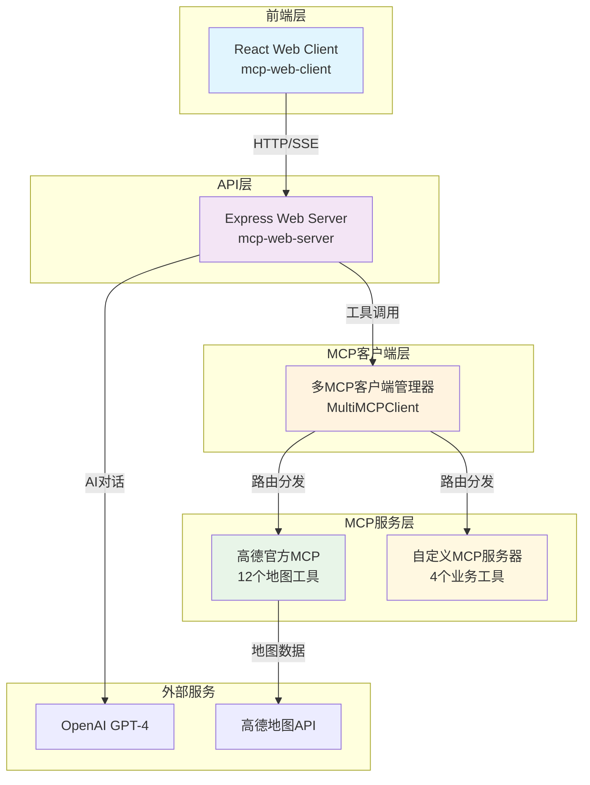
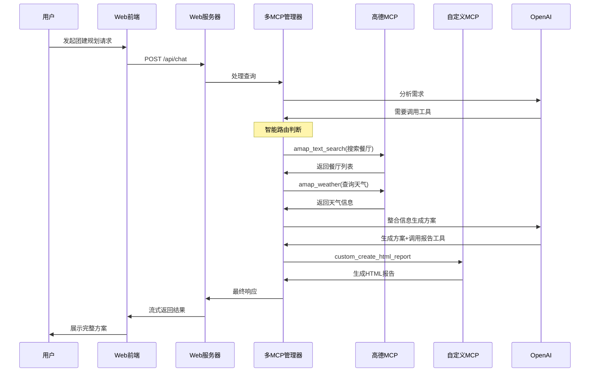
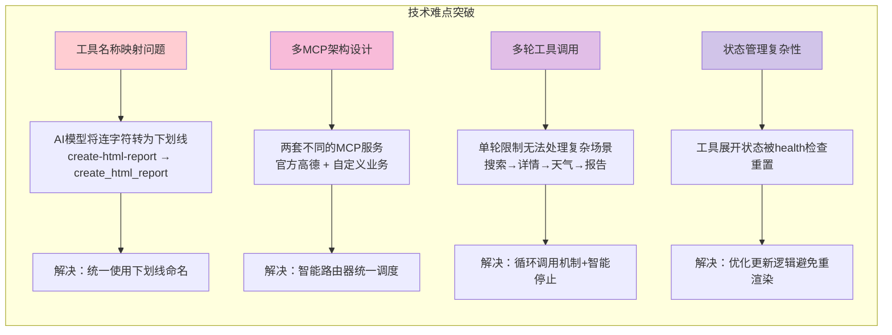

# MCP团建规划系统 - 项目分享

## 📋 项目概述

**MCP团建规划系统**是一个基于Model Context Protocol（模型上下文协议）的智能团建活动规划演示项目。该项目展示了如何构建复杂的AI工具调用系统，实现从需求收集到方案生成的完整团建规划流程。

### 🎯 项目目标
- **技术演示**：展示MCP协议的实际应用能力
- **工具调用**：演示复杂的多轮工具调用场景
- **架构设计**：探索多MCP服务集成的最佳实践
- **业务价值**：提供实用的团建规划解决方案

---

## 🏗️ 项目架构

### 整体架构图



### 核心组件详解

#### 1. **前端层 (mcp-web-client)**
- **技术栈**: React + CSS3
- **核心功能**: 
  - 响应式用户界面
  - 实时流式响应展示
  - 工具调用过程可视化
  - 多轮对话状态管理

#### 2. **API层 (mcp-web-server)**
- **技术栈**: Express.js + Server-Sent Events
- **核心功能**:
  - RESTful API设计
  - 流式响应处理
  - 会话管理
  - 健康检查监控

#### 3. **MCP客户端层 (mcp-client)**
- **技术栈**: Node.js + MCP SDK
- **核心功能**:
  - 多MCP服务统一管理
  - 智能工具路由
  - 多轮对话支持
  - 工具名称映射

#### 4. **MCP服务层**
- **高德官方MCP**: 12个地图相关工具
- **自定义MCP服务器**: 4个业务逻辑工具

---

## 🚀 核心功能

### 功能流程时序图



### 功能特性详述

#### 1. **智能团建规划** 🎯
- **需求分析**: 自然语言理解用户需求
- **地点推荐**: 基于高德地图的真实POI数据
- **方案生成**: 多档次方案自动生成
- **报告输出**: 精美HTML报告一键生成

#### 2. **多MCP集成** 🔗
- **官方MCP**: 
  - 地理编码 (geocoding/reverse_geocoding)
  - POI搜索 (text_search/around_search)  
  - 天气查询 (weather)
  - 路线规划 (driving/walking/bicycling)
- **自定义MCP**:
  - HTML报告生成 (create_html_report)
  - 天气预警 (get-alerts)
  - 预报查询 (get-forecast)
  - 计算工具 (calculate)

#### 3. **多轮工具调用** 🔄
- **循环调用机制**: 最多5轮智能循环
- **智能停止检测**: 避免无限循环
- **状态追踪**: 详细的调用过程记录
- **错误恢复**: 优雅的错误处理机制

#### 4. **实时交互体验** ⚡
- **流式响应**: Server-Sent Events实时推送
- **状态展示**: 工具调用过程可视化
- **会话管理**: 支持多轮对话记忆
- **响应式设计**: 适配各种设备尺寸

---

## ⚡ 技术难点与解决方案

### 技术挑战解决图



### 难点详解

#### 1. **多MCP架构统一管理** 🏗️

**挑战**: 如何统一管理两个完全不同的MCP服务？
- 高德官方MCP使用标准MCP SDK
- 自定义MCP使用自研协议

**解决方案**:
```javascript
class MultiMCPClient {
    // 智能路由器设计
    getMcpClientForTool(toolName) {
        if (toolName.startsWith('amap_')) {
            return { client: this.amapMcp, source: 'amap' };
        } else if (toolName.startsWith('custom_')) {
            return { client: this.customMcp, source: 'custom' };
        }
    }
}
```

#### 2. **工具名称映射机制** 🔧

**挑战**: AI模型经常将连字符`-`替换为下划线`_`
- 定义: `create-html-report`
- 调用: `create_html_report`
- 结果: 工具找不到错误

**解决方案**: 统一命名规范，全部使用下划线
```javascript
// 工具定义统一使用下划线
name: "create_html_report"
```

#### 3. **多轮工具调用实现** 🔄

**挑战**: 复杂业务场景需要多步骤工具调用
```
搜索餐厅 → 获取详情 → 查询天气 → 生成报告
```

**解决方案**: 循环调用机制
```javascript
async processQueryWithMultiRoundTools(query) {
    let currentQuery = query;
    let roundCount = 0;
    const maxRounds = 5;
    
    while (roundCount < maxRounds) {
        const result = await this.executeToolsForRound(currentQuery);
        if (result.shouldStop) break;
        currentQuery = result.nextQuery;
        roundCount++;
    }
}
```

#### 4. **前端状态管理优化** 🎨

**挑战**: Health检查导致组件重新渲染，工具展开状态丢失

**解决方案**: 优化状态更新逻辑
```javascript
// 避免不必要的组件重渲染
const updateHealthStatus = useCallback((newStatus) => {
    setHealthStatus(prev => {
        if (JSON.stringify(prev) === JSON.stringify(newStatus)) {
            return prev; // 避免状态重置
        }
        return newStatus;
    });
}, []);
```

---

## 📊 工作量评估

### 开发阶段分析

#### **阶段一: 基础架构搭建** (30%)
- MCP服务器开发
- 基础客户端实现  
- 简单工具调用验证
- **工期**: 约2-3天

#### **阶段二: 多MCP集成** (25%)
- 高德官方MCP集成
- 多MCP客户端管理器设计
- 工具路由机制实现
- **工期**: 约2天

#### **阶段三: Web界面开发** (20%)
- React前端界面
- 流式响应实现
- 工具调用可视化
- **工期**: 约1-2天

#### **阶段四: 高级功能实现** (25%)
- 多轮工具调用机制
- 会话管理系统
- 错误处理优化
- 各种bug修复
- **工期**: 约2-3天

### 代码规模统计

```
总代码行数: ~2000+ 行
├── mcp-server/        ~400 行
├── mcp-client/        ~600 行  
├── mcp-web-server/    ~450 行
├── mcp-web-client/    ~500 行
└── 配置文件/文档      ~200 行
```

### 技术复杂度评估

| 维度 | 复杂度 | 说明 |
|------|--------|------|
| **架构设计** | ⭐⭐⭐⭐⭐ | 多MCP集成，统一管理 |
| **工具调用** | ⭐⭐⭐⭐ | 多轮调用，智能路由 |
| **前端交互** | ⭐⭐⭐ | 流式响应，状态管理 |
| **错误处理** | ⭐⭐⭐⭐ | 多层错误恢复机制 |
| **性能优化** | ⭐⭐⭐ | 状态优化，内存管理 |

---

## 💡 项目价值与意义

### 技术价值

#### 1. **MCP协议最佳实践** 📚
- 展示了MCP协议在实际项目中的应用模式
- 提供了多MCP服务集成的标准解决方案
- 为团队后续MCP项目提供参考架构

#### 2. **复杂工具调用场景探索** 🔬
- 验证了多轮工具调用的可行性
- 解决了工具调用中的常见问题
- 建立了工具调用的最佳实践

#### 3. **架构设计能力提升** 🏗️
- 分层架构设计经验
- 微服务集成实践
- 实时通信技术应用

### 业务价值

#### 1. **实际应用场景** 🎯
- 团建活动规划自动化
- 提升团队活动组织效率
- 为类似业务场景提供模板

#### 2. **用户体验创新** ✨
- 自然语言交互界面
- 实时反馈机制
- 可视化工具调用过程

### 团队价值

#### 1. **技能提升** 📈
- AI工具调用技术
- 流式响应处理
- 复杂状态管理

#### 2. **项目经验** 🎖️
- 完整项目生命周期
- 问题解决能力
- 技术选型经验

---

## 🔮 未来展望

### 短期优化方向

#### 1. **功能增强** 🚀
- [ ] 支持更多地图功能（路线规划、导航）
- [ ] 添加餐厅预订集成
- [ ] 增加费用预算优化算法
- [ ] 支持多种报告格式输出

#### 2. **技术优化** ⚡
- [ ] 添加Redis缓存层
- [ ] 实现用户认证系统
- [ ] 优化前端打包体积
- [ ] 添加单元测试覆盖

### 长期发展规划

#### 1. **平台化发展** 🌐
- 多租户支持
- 插件化架构
- 开放API平台
- 企业级安全认证

#### 2. **AI能力扩展** 🤖
- 接入更多AI模型
- 支持多模态输入
- 智能推荐算法
- 个性化定制

#### 3. **生态建设** 🌱
- MCP工具市场
- 开发者社区
- 最佳实践文档
- 培训认证体系

---

## 📝 总结

MCP团建规划系统是一个技术含量高、实用价值强的演示项目。通过这个项目，我们：

✅ **技术突破**: 解决了多MCP集成、多轮工具调用等复杂技术问题  
✅ **架构创新**: 建立了可复用的MCP服务架构模式  
✅ **经验积累**: 为团队提供了宝贵的AI工具调用实践经验  
✅ **价值创造**: 开发了实际可用的团建规划解决方案  

这个项目不仅展示了团队的技术实力，更为后续的AI工具调用项目奠定了坚实基础。相信通过这次分享，大家对MCP协议和AI工具调用有了更深入的理解。

---

*本文档生成时间: 2024年12月27日*  
*项目仓库: [mcp-learning](https://github.com/your-repo/mcp-learning)* 